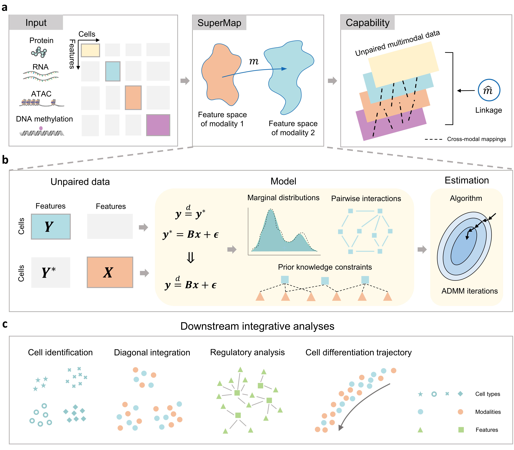

# SuperMap: Bridging Unpaired Single-Cell Multimodal Data for Integrative Analyses

## Description

**SuperMap** is an R package for the integrative analyses of unpaired single-cell multimodal data. While a substantial amount of single-cell multimodal data has been generated and accumulated, most of these datasets are unpaired, characterized by distinct feature spaces and a lack of cell-wise correspondence. The absence of explicit linkages between modalities poses a fundamental challenge for data integration and interpretation. To address this, we introduce SuperMap, an unsupervised statistical learning method. SuperMap learns cross-modal mappings to effectively bridge and link different modalities, facilitating a wide range of downstream integrative analysis tasks, including cell-type identification, diagonal integration, regulatory analysis, and trajectory inference.

 <!-- Replace with the actual path of the image -->

## Installation

SuperMap is implemented as an R package which can be installed by running the following command in R:

```r
devtools::install_github('chaodeng-aca/SuperMap')
```

## Usage

For usage examples and a guided walkthrough, please refer to `vignettes` directory provided in the repository. The processed data generated during the tutorial can be found in the `data` directory.
